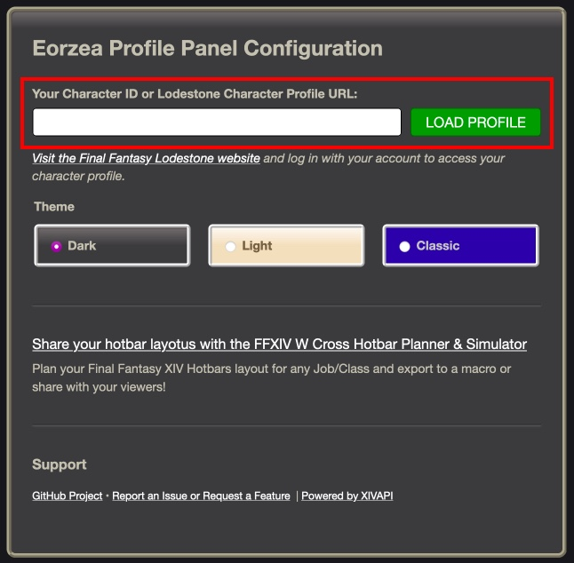
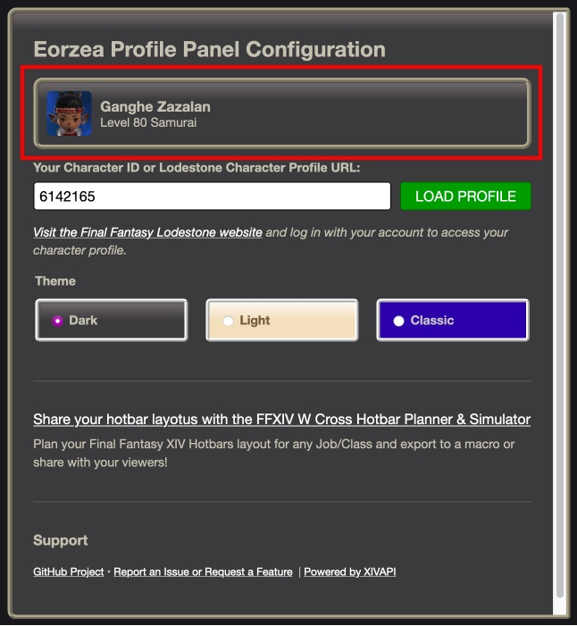

# Eorzea Profile Panel

A Final Fantasy XIV Profile Panel Extension for Twitch Streamers.

View Recent changes in the [Changelog](/CHANGELOG.md).

## Quickstart

1. **Install** the extension from the [Twitch Extensions dashboard](https://dashboard.twitch.tv/extensions/bsdr8tkgubqusuao9ixx6wjyhxy8je-1.0.0).

   

2. Find your Final Fantasy XIV Character ID

   1. [Log into the Final Fantasy XIV Lodestone website](https://na.finalfantasyxiv.com/lodestone/)

      > 

   2. Select the character you want to display on the profile panel.

      > 

   3. Follow the link to your Character's profile page

      > 

   4. Your character ID is shown as part of the page URL. You can copy the entire URL or just the ID number.

      > 

3. Configure the extension

   1. Back on the Twitch Extension Dashboard, open the extension configuration page and paste the Character ID or the Character Profile URL into the extension configuration page.

      > 

   2. Clicking on the **SAVE** button will fetch the Character Profile and confirm that it was able to find your character. You can now close this window and active the panel. Make sure to set it to an active panel to display your Final Fantasy XIV profile on your stream page.

      > 

## How to Contribute

### Request a Feature or Report an Issue or Bug

Please create an issue in the [Issues section](https://github.com/bdejesus/twitch-xiv-profile/issues)
